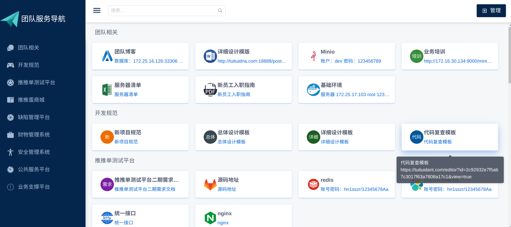
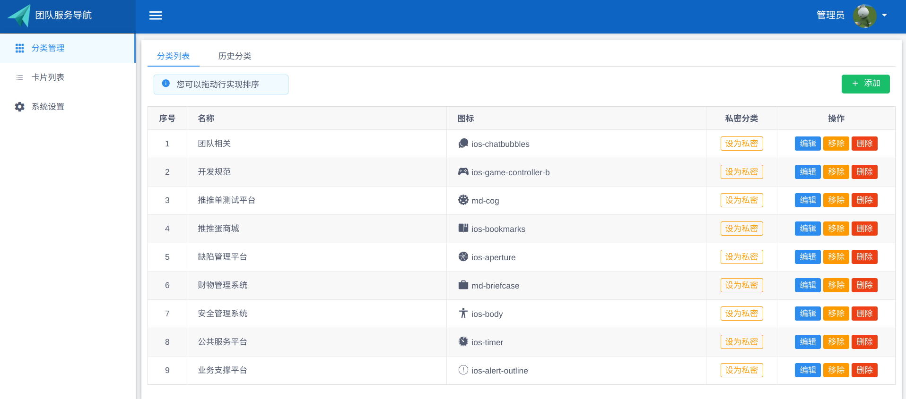
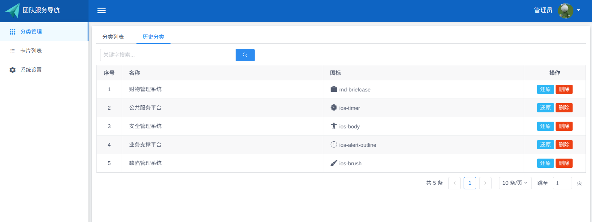
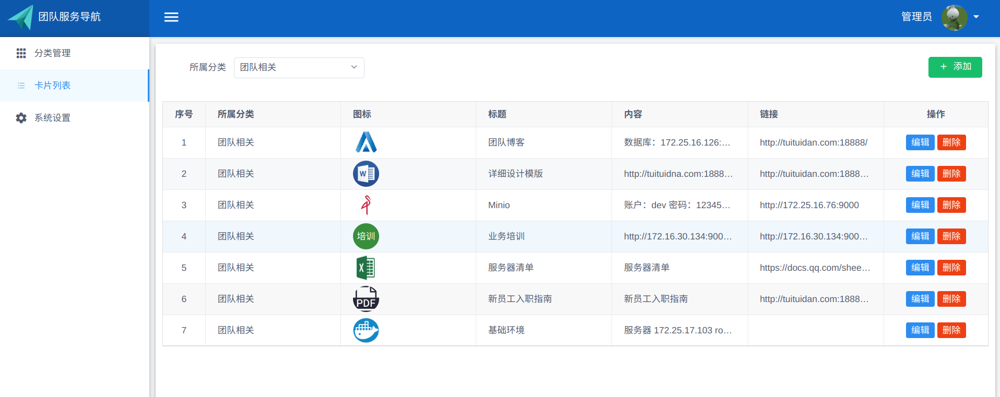
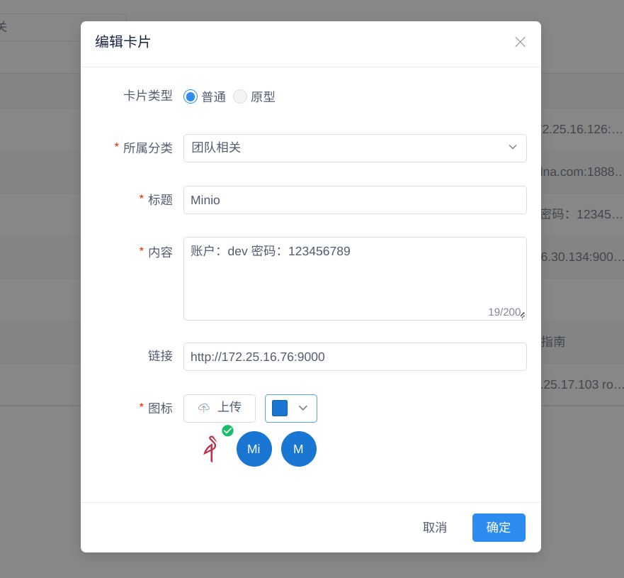
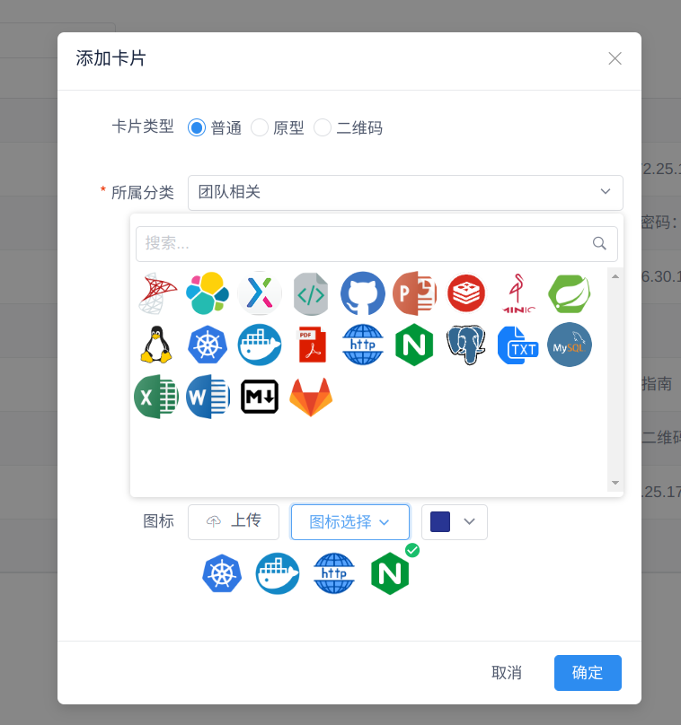
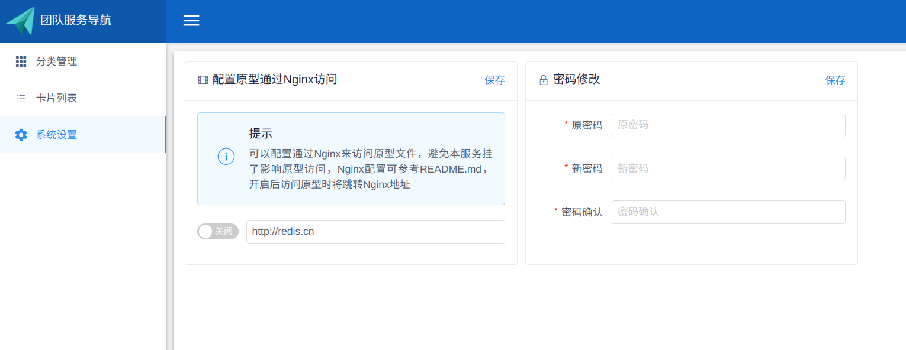

# 团队服务导航

      

## 简介

前后端完整的网址导航服务，本系统定位于研发团队内部使用，提供多种的卡片图标生成方式，以保持页面美观，能将上传的原型压缩包自动生成可访问的地址。

**Github:** https://github.com/tuituidan/team-nav

**Gitee:** https://gitee.com/tuituidan/team-nav

## 功能说明

- 网址导航前端展示+搜索功能，[首页图](#首页图)。
- 网址导航后台基本功能：分类和卡片的增删改查，[后台-分类管理图](#后台-分类管理图)  [后台-卡片管理图](#后台-卡片管理图)。
- 分类和卡片支持拖拽调整顺序，不用专门维护排序字段。
- 支持添加秘密卡片分类，该分类下的卡片需要登录才能看见。
- 暂时不需要的分类支持移除功能，移除后分类列表页面不可见，可从历史分类中还原回来，[后台-历史分类图](#后台-历史分类图)。
- 卡片图标支持四种方式
  - 根据截取填写的【标题】文字的前一个和前两个字生成，并可以为其选择背景色。
  - 根据填写的链接自动获取该链接的获取`favicon.ico`图标。
  - 用户可以手动上传。
  - 可配置默认常用的一些图标，直接选择（搜索按图标文件名搜索），[卡片图标选择图](#卡片图标选择图)。
- 三种卡片类型说明
  - 普通类型：标题，内容，图标为必填，链接非必填，没有链接只是作为少量信息展示，点击卡片不会跳转页面。
  - 原型类型：标题，内容，图标，原型文件为必填，原型文件上传后会自动生成原型展示的链接，点击卡片可跳转到该地址。
  - 二维码类型：标题，内容，图标，链接均为必填，鼠标滑到卡片上会显示链接的二维码，可用手机进行扫描，方便进行移动端网址显示，[二维码展示图](#二维码展示图)。
- 原型可通过配置Nginx访问，[后台-系统设置图](#后台-系统设置图)。

## 设计说明

- 以SpringDataJpa+H2数据库（文件存储方式）的方式进行数据存储，避免单独部署数据库，直接启动jar包，自动生成。
- 上传的图标，原型文件等，均以本系统resource方式存储（能通过链接访问），也是为了避免单独引入其他对象存储中间件，保持系统小巧。
- 本系统定位就是团队内部导航，不是那种提供很多公共服务的网址导航服务，作者在使用时往往一个分类就是一个项目名称，正在运行中的项目不会太多，所以分类没有做二级分类，当一个项目已经归档，就可以移除到历史分类中，以后需要还原回来即可。
- 本系统来源于作者在公司内部开源的一个项目，本来有一些自动登录、单点登录及卡片权限分配等功能，但这些都是需要公司有对应的公共服务才行，所以本系统就阉割成了只有一个管理员维护，管理员账号密码直接在application.yml中配置，保留了一个私密卡片权限，需要登录才可看到。
- 原型文件的上传算是本系统一个亮点，也正是因为定位于研发团队内部使用，才有这样的功能。很多需求人员画了原型并不懂怎么静态部署，往往直接发压缩包给研发人员，再多改几次需求，压缩包就传来传去一大堆，非常的麻烦。本系统只需要需求人员将导出的原型文件打包成zip压缩包上传即可直接生成访问链接，需求人员用了都说好，研发需求关系更加和谐了。
- 系统使用vue但是并未前后端分离，一来是系统本来也小，懒得单独建前端工程，二来也是作者想尝试一下通过后端thymeleaf来完成前端页面的模块组件的开发，过程中也是碰到一些问题，只能说，这种方式果然只适合小一点的项目，不然坑还是比较多。

## 技术栈

#### 前端

- js框架：Vue
- UI框架：ViewUI（iview升级版）

#### 后端

- Springboot
  - SpringDataJpa：持久层框架
  - thymeleaf：页面渲染
  - SpringSecurity：后台登录
- 数据库：H2
- 其他
  - ApacheCommons相关工具包
  - Jsoup：解析目标网址的favicon.ico
  - zip4j：对原型压缩包进行解压
  - google.zxing：二维码生成

## 部署说明

#### 方式一：手动部署

从[Releases](https://github.com/tuituidan/team-nav/releases)下载team-nav.tar.gz放到服务器上解压，对应修改config/application.yml文件，使用使用team-nav/bin/start.sh 启动项目即可。

#### 方式二：docker部署

docker启动

```
docker run -d -p 8082:8080 \
-v /opt/team-nav/logs:/logs \
-v /opt/team-nav/database:/database \
-v /opt/team-nav/ext-resources:/ext-resources \
-e nav-name="团队导航服务" \
registry.cn-chengdu.aliyuncs.com/tuituidan/team-nav:1.0.2

```

参数说明：

- logs、database、ext-resources分别将日志，数据库文件，额外资源（自定义图标和原型文件等）挂载出来。
- nav-name：导航服务的名字，可不传，默认"团队导航服务"。

其他参数参考config/application.yml。

#### nginx部署（非必须）

如果不希望因为本服务停掉导致原型也无法访问，可以在后台系统设置中设置原型通过nginx访问，nginx配置示例如下：

```nginx
# 将/ext-resources/modules的请求地址拦截并访问到目录/opt/team-nav/team-nav/ext-resources/modules
location /ext-resources/modules {
	alias   /opt/team-nav/ext-resources/modules;
	index  index.html index.htm;
}
```

#### 卡片图标放置

如图 [卡片图标选择图](#卡片图标选择图) ，如果希望出现该图标选择按钮，需要将一些自己常用的图标放置到`/ext-resources/images/default`文件夹下，图标文件名会用于搜索。

本源码提供了一些图标，将`docs`文件夹下的`default`文件夹拖到`/ext-resources/images`下即可。

如果系统已经启动再放图标进去，就需要重启系统进行加载，主要是考虑这个操作不多，就不考虑定时刷新了。

## 版本说明

- 1.0.2

  - 增加根据配置开启和关闭登录功能
  
    `yml`中`login.enable`可配置开启关闭登录功能，默认true开启，配置为false后进入后台将不再需要登录，也不再支持私密卡片功能。
  
- 1.0.1

  - 修复了一些bug
  - 优化了一些样式
  - 添加了卡片常用图标选择功能
  - 卡片类型增加了二维码类型，**注意如果是从老版本升级到此版本，原来card表的type字段的数据，`1`矫正为`default`，`2`矫正为`zip`**，主要考虑这样更有意义一些，方便后续扩展其他类型。

- 1.0.0

  - springboot从2.2.10.RELEASE升级到2.7.3
  - 默认的h2数据库从v1升级到v2，不兼容v1，建议直接部署team-nav:1.0.0，然后将数据手动迁移到新库

- 0.0.1-SNAPSHOT

  没有正式发布

## license

100%开源，MIT协议，可自由修改

## 页面展示

#### 首页图



#### 后台-分类管理图




#### 后台-历史分类图



#### 后台-卡片管理图





#### 卡片图标选择图



#### 二维码展示图


#### 后台-系统设置图

